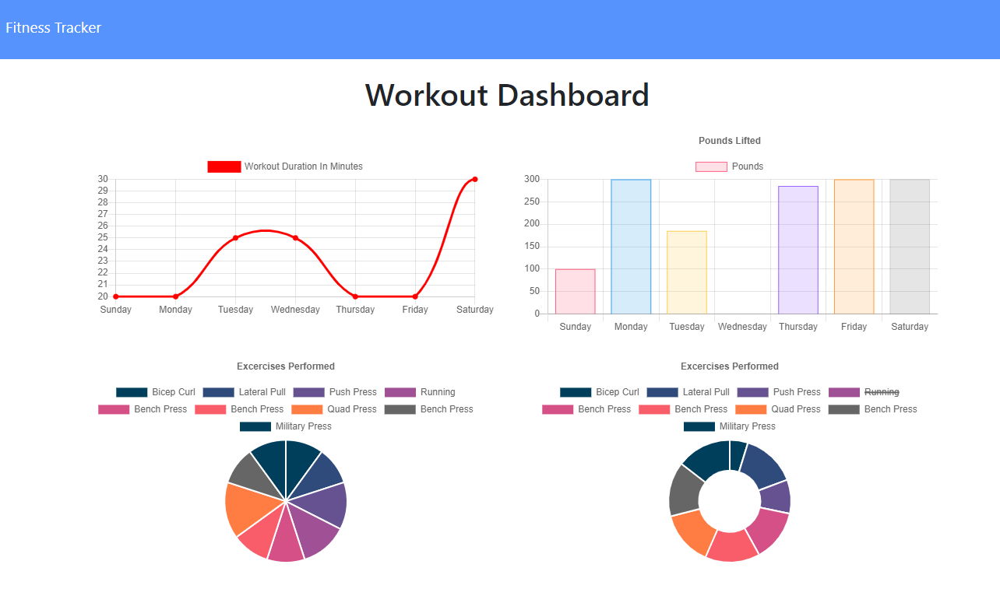

# Workout Tracker

This application is a workout tracker. I was provided with the front end code. This assignment objective was to create a Mongo database with a Mongoose schema and handle routes with Express.

## User Story

* A user is able to view create and track daily workouts and be able to log multiple exercises in a workout on a given day. The user is  also able to track the name, type, weight, sets, reps, and duration of exercise and the distance traveled on the workout.

## Business Context

A consumer will reach their fitness goals more quickly when they track their workout progress.

- - -
### __This is a link to a deployed application:__

_[Click Here for the Heroku’s Deployed Application](https://salty-wildwood-47261.herokuapp.com/stats)_

- - -
### **This is a preview of the app**

